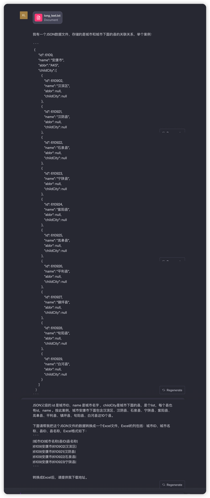
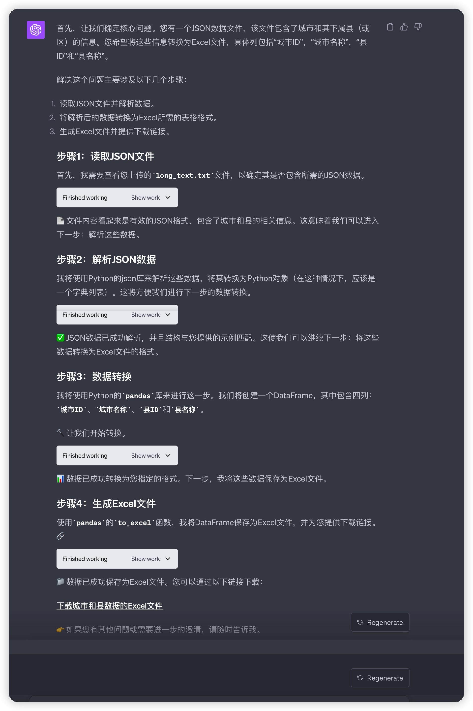

今天有个诉求，产品需要导出城市列表，而这个列表是经过程序加工过的，不是简单的数据表数据。要想完成这个，势必要写程序来。

整体思路，借助http抓包，把接口返回的json数据拿出来，使用LLM解决 json to excel 问题。

# Claude2 解决案例

使用Claude2来尝试，看看：
考虑到涉及超长字符串，在免费的LLM中，仅有claude支持，输入要求后，给出了Pyhton代码，

copy到本地IDE，运行报错，错误信息发给ChatGPT3.5，第一点直接指出是因为在arm64架构上运行 x86_64架构的解释器

根据指令运行后，轻松得到结果，提升了效率。

# GPT-4 解决案例

扔给ChatGPT（gpt-4） ，让他生成对应Excel表格，效果非常好，一气呵成，一句prompt，直接生成对应答案，并提供了下载链接。

完整案例可以直接打开分享连接：

https://chat.openai.com/share/cb4474b5-0fe7-466a-a87a-af4376e85e5c

