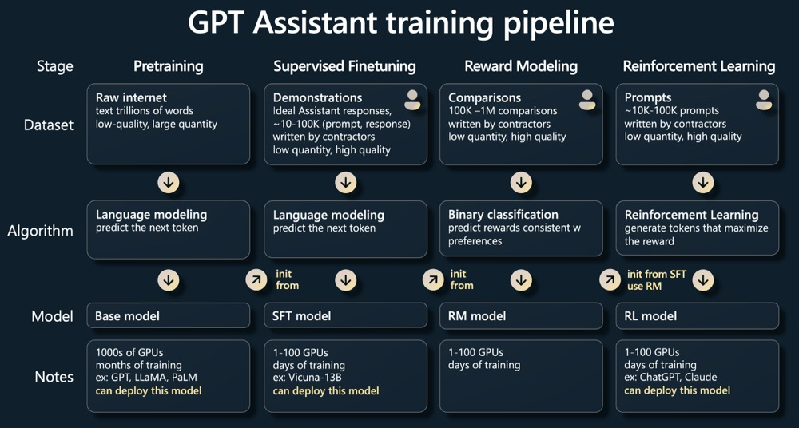
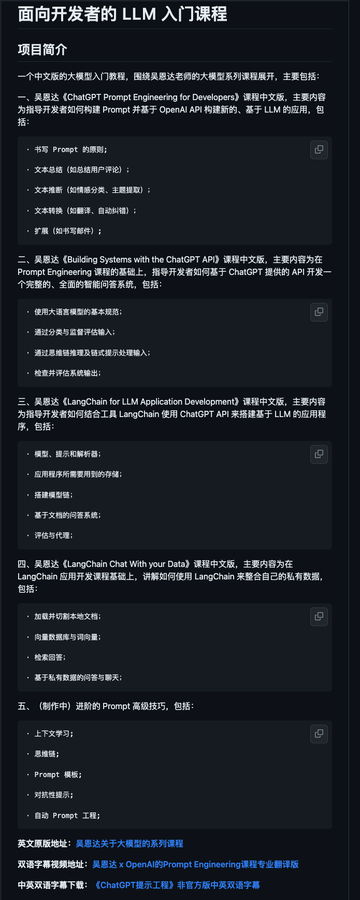

[TOC]

先看看业界大佬们对”大模型“的看法，让我们引起足够的重视，拥抱变化，积极探索学习。

> 比尔盖茨：这场由ChatGPT衍生开来的人工智能革命是他所见到的自1980年以来最具革命性的技术进步。他认为大模型有可能彻底改变许多行业，包括医疗保健、教育和金融，它们有可能彻底改变我们的生活方式，但我们需要确保它们被负责任地开发和使用。”
> 
> 英伟达黄仁勋： “我们正处在 AI 的 iPhone 时刻。如果把加速计算比作曲速引擎，那么 AI 就是动力来源。生成式 AI 的非凡能力，使得公司产生了紧迫感，他们需要重新构思产品和商业模式。”
> 
> 百度李彦宏：“我们正处在全新起点，这是一个以大模型为核心的人工智能新时代，大模型改变了人工智能，大模型将改变世界。”
>
> 阿里张勇：“面向AI时代，所有产品都值得用大模型重新升级。AI大模型的出现是一个划时代的里程碑，人类将进入到一个全新的智能化时代，就像工业革命一样，大模型将会被各行各业广泛应用，带来生产力的巨大提升，并深刻改变我们的生活方式。“
> 
> 腾讯马化腾：AI 是几百年不遇的“工业革命”。“我们最开始以为这是互联网十年不遇的机会，但是越想越觉得这（AI）是几百年不遇的、类似发明电的工业革命一样的机遇，所以我们觉得（AI）非常重要，但是这个的确需要有很多的积累。”
>
> 网易丁磊：未来，随着AI大模型的发展，企业会逐渐找到优化路径，不断降低大模型研发所需的资金和算力。在AI大模型竞赛中，真正的胜者是能选择好应用场景的企业。
>
> 360周鸿祎：大模型是工业革命级的生产力工具，将会带来一场新工业革命，GPT不仅仅是一个聊天机器人，也不是像抖音这样消磨时间的娱乐工具，而是一个提高生产力的工具。它不仅仅是公司间竞争的利器，更重要的是它像发电厂一样，把以前我们都有但很难直接使用的大数据从石油加工成了“电”，“电”是通用的，能赋能百行千业，就能在实体经济转型数字化、智能化过程中发挥重要作用。
>
>科大讯飞刘庆峰：大模型不仅可以带来内容的生产和分发方式的全新变化，人机交互的根本性变革，也会对科研、办公、工业互联网带来全新的颠覆和全新的机遇。“传统意义上靠堆时长和人力的商业模式，在未来的两三年之内将被彻底地改变，所以它在历史上的战略意义，相当于PC和互联网的诞生，我认为这样一个论断毫不夸张。”

个人认为 AI大模型是未来的新机会，所有的工程师都应该去拥抱学习、适应，这个 repo就是个人学习 AI 大模型过程中，收集的一些资料，做了分类整理，也有一些总结，希望对你有帮助。

# AI News

[揭秘OpenAI成长史：顶级资本与科技大佬的理想主义，冲突，抉择与权力斗争；马斯克、奥特曼、纳德拉与比尔·盖茨等人的背后故事_哔哩哔哩_bilibili](https://www.bilibili.com/video/BV1ka4y1V7uP/?vd_source=c35465296cfe1fefc212d3431eef636b) 30 分钟视频讲述了 OpenAI 的生死时刻，sam 怎么起死回生，很是精彩，推荐。

[AIGC“尖峰系列” | OpenAI CEO最新访谈，3万字全文详述技术、竞争、恐惧和人类与AI的未来 ](https://mp.weixin.qq.com/s/nRqz8sUB5J0MXeY8bn1lBg)

[OpenAI 何以掀翻 Google 布局多年的AI大棋？ ](https://mp.weixin.qq.com/s/qWQ6xVfQVEOJriYRVFWCrQ)

[AI狂飙的时代，人还有价值吗？ ](https://mp.weixin.qq.com/s/7H1FrwbQvsh0HD9z90L0wg)

[比尔盖茨：人工智能时代已经开始 | 盖茨笔记 ](https://mp.weixin.qq.com/s/pYjY_LT8I33YqCn415AUAA)

[Nvidia H100 GPU 供需现状：43 万张 H100，Nvidia 将如何分配？ (qq.com)](https://mp.weixin.qq.com/s/ClWZVfHLwzHZg8uhfwLHvA)

[值得听的7个AI播客节目](Information/AI-podcast.md)，这个非常推荐，通勤路上可以听听，都是大佬的思想，很有启发性。

去[news 频道](Information/opportunity-news.md) 查看更多最新 AI 资讯内容。

# GPT 工具

强烈建议不要在各种微信公号或者微信群里面，体验那种免费几次，之后就要付费的，号称是【chatGPT中文版】或者【chatGPT国内镜像版】的各类chat，为什么？

你知道他背后是用的是啥，是 OpenAI 的 chatGPT 模型么，是 3.0 的还是 3.5 的版本？还是找个某开源的大模型，自己私有化部署下，弄个看起来结果很像的东西，上来割韭菜？ 如果精准、持续、大量使用，一定要用原版官方版本。

ChatGPT 官网网址： https://chat.openai.com ，作为互联网人的个体，自己去解决科学上网、海外手机号的问题，这类文章网上一搜一大把，留心点，开通 账号不是问题。

其他备选工具：
- Claude2 效果比 chatGPT 要好，比 GPT-4 要差，但对于普通用户来说，注册及其简单，美国/英国网络地址，输入邮箱即可使用。 官网地址： https://claude.ai  ，Claude2 的能力可以参考这篇文章 [体感比 chatGPT 效果好的免费工具 Claude2](claude2.md)
- New bing ，GPT-4 能力加持下的新一代搜索引擎，专注于搜索，能搜到最新的新闻资讯。官网地址： https://www.bing.com ，显示不出来的，把地址更换到美国，使用美国梯子。
- Google Bard ，相比前面的 chatGPT、Claude2、New bing，个人感觉效果最差的一个，好在免费，要给 Google 账号既可以试用，注意美国梯子。 官网地址： https://bard.google.com/
- 编程类：Github copilot ，进化非常快，辅助编程的日常工作的确能带来效率提升。 官网地址： https://github.com/features/copilot
- 国内的大模型，目前个人感觉还比较落后，地址不列举了，感兴趣的自己去官网体验吧。

### GPT-4

至于 GPT-4 ，个人推荐有余力的同学尽快开通体验，目前业界最顶级的大模型，紧跟 AI 大时代的发展，就得多体验，多思考，升级 GPT-4 [汇总4 类升级GPT-4的方法，总有一种适合你](upgrade-GPT-4.md)

### 加快梯子上网速度

之前写过一篇文章，介绍 [Clash](https://dreamacro.github.io/clash/)  软件如何自定义配置，加快访问速度的，因为默认的规则有几万条，在几万条规则里面路由，也是需要耗时的，自定义调整后，去掉不用的，每个人可能也就几十条
经过同事们的体验，效果的确比默认要好很多，大家有需要的也可以配置下，配置方法参考 [自定义配置，加快梯子科学上网访问速度](improve-speed-of-ladder.md)

# 向普通人解释 GPT 原理

OpenAI 的联合创始人Andrej Karpthy 在2023 微软开发者大会上的演讲 PPT，非常重磅，详细讲述了 GPT 的训练过程。**个人感觉，把这篇视频看 10 遍，基本上就知道 ChatGPT 怎么训练出来的，有哪些缺陷，以及有哪些应用场景了。**

> 在这个朴实无华的题目之下，Andrej带来的是一场超级精彩的分享。 他详细介绍了如何从GPT基础模型一直训练出ChatGPT这样的助手模型（assistant model）。作者不曾在其他公开视频里看过类似的内容，这或许是OpenAI官方第一次详细阐述其大模型内部原理和RLHF训练细节。 
> 难能可贵的是，Andrej不仅深入了细节， 还高屋建瓴的抽象了大模型实现中的诸多概念，牛人的洞察就是不一样。 比如，Andrej非常形象的把当前LLM大语言模型比喻为人类思考模式的系统一（快系统），这是相对于反应慢但具有更长线推理的系统二（慢系统）而言。这只是演讲里诸多闪光点的其中一个。
> Andrej真的有当导师的潜力，把非常技术的内容讲得深入浅出，而又异常透彻。这个演讲完全可以让非专业人士也能理解，并且，认真看完演讲后会有一种醍醐灌顶的感觉。

**视频地址：**
- 微软官方英文原版 [State of GPT | Microsoft developers](https://www.youtube.com/watch?v=bZQun8Y4L2A) 可以配合[YouTube双语字幕插件)](https://www.dual-subtitles.com/)使用，效果最好。整理的中文文字稿如下：[state-of-gpt-中文稿](state-of-gpt-中文稿.md)
- 也可以直接看网友翻译后的中文版本 [State of GPT（GPT的现状）中文字幕精校版 | Andrej Karpathy 微软Build大会精彩演讲 | GPT状态和原理 | 解密OpenAI模型训练 - YouTube](https://www.youtube.com/watch?v=b8WIHOcp9ck)
- 有中文的总结文章参考：[精华笔记：微软 Build 2023 开发者大会专题演讲：State of GPT（GPT 的现状） - 知乎 (zhihu.com)](https://zhuanlan.zhihu.com/p/634545092)
- 视频中原版英文 PPT 如下 ，

## 官方论文解读
[GPT-4论文精读【论文精读·53】_哔哩哔哩_bilibili](https://www.bilibili.com/video/BV1vM4y1U7b5/?vd_source=c35465296cfe1fefc212d3431eef636b)

于此同时，推荐 B 站的专栏 [跟李沐学AI](https://space.bilibili.com/1567748478)，这里面有很多读论文的资料，论文是了解细节的最好的手段，最重要的是，你无需科班出身也能听懂，真正的普通人也可以听懂的论文拆解，非常好。

《GPT_4，通用人工智能的火花》154页微软GPT研究报告（全中文版）

## 其他文章

[ChatGPT 中，G、P、T 分别是什么意思？ ](https://mp.weixin.qq.com/s/vXoYeA7w6l_WiKmDHogdTA)

[通俗解构语言大模型的工作原理](https://mp.weixin.qq.com/s/PPXaOrLnIV6JlXvgYB74Wg) 这里面文字白话介绍词向量、词预测、以及Transformer架构原理，整篇文章篇幅很短，适合粗略的阅读看看，里面说的 transformer 架构可以看这个小视频，更加形象的理解 https://m.okjike.com/originalPosts/64be4d567b5daee543aba806

[独家 | 解析Tansformer模型—理解GPT-3, BERT和T5背后的模型](https://mp.weixin.qq.com/s/kfsW7ccYUAGp1AHWWF6c1w)  你知道这句话吗，当你有一把锤子的时候，所有东西看起来都像钉子? 在机器学习中，我们似乎真的发现了一种神奇的锤子。实际上，在这个模型面前所有东西都是钉子，这就是Transformer模型。

为什么尽量用英文写 prompt ？这篇文章给你答案。[AI如何通过“切割术”理解我们的语言：探索大语言模型时代的语言不平等问题](https://mp.weixin.qq.com/s/wDQ9o-3hnDcmWVMj6WdO2Q)

# 学习课程

## 吴恩达联合 OpenAI 课程

这个课程内容质量非常高，推荐都去看看，已经翻译成中文了，方便阅读。 [吴恩达大模型系列课程中文版，包括《Prompt Engineering》、《Building System》和《LangChain》 (github.com)](https://github.com/datawhalechina/prompt-engineering-for-developers)

## 微软 AI for Beginner

[microsoft/AI-For-Beginners: 12 Weeks, 24 Lessons, AI for All! (github.com)](https://github.com/microsoft/AI-For-Beginners) 

## 其他
[Welcome to LLM University! (cohere.com)](https://docs.cohere.com/docs/llmu)

# 写好提示词

截止到2023.7月份，有两大 prompt 撰写模型，一个是以 CRISPE 为代表的 `背景-身份-指令` 模型，一个是以 `langGPT` 为代表的 `结构化prompt` 模型，效果都不错，具体可以看下面。

这个 md 是专门写提示词的，里面介绍了什么是prompt、prompt 原则、prompt 模型、prompt 编程等概念，详细参考 [AI时代，人人必备的高质量提示词撰写技巧](prompt-Writing.md)

# 业界实践

看看我司日常研发、测试过程中的实践 case，具体查看
- [[中文语义理解](practice-cases/中文语义理解.md)]
- [辅助解决日常难题](practice-cases/辅助解决日常难题.md)

# 大模型目前的局限性

已知的目前无法解决的问题
- 大模型本身的幻觉问题，参考上图
- 大模型本身知识老旧问题，如数据库截止到2021年底
- 大模型的数学推理能力弱问题 (解数学问题)
- 大模型的视觉能力弱问题(构建 SVG 矢量图等场景)
- 大模型字数统计问题（不论是字符数和 token 数，大模型都无法统计准确。需要输出指定字数时，将数值设定的高一些，后期自己调整一下，比如希望他输出100字文案，告诉他输出150字。）
- 同一 Prompt 在不同模型间的性能差异问题
- 其他已知问题等

大模型目前无法取代工程师

# 大模型对未来的影响

> 对于现阶段来说，LLM 是一个 Copilot。它不会不改变软件工程的专业分工，但增强每个专业技术，基于AI的研发工具平台辅助工程师完成任务，影响个体工作。
> thoutworks - Phodal

[‍‌​⁢‍⁢⁤⁡⁡⁡⁡⁤‌⁡‍⁣‬​⁢⁡‍⁤⁣⁣‍​⁤‍⁤​⁤⁤​⁡‬‌‍⁣‍⁤⁢⁤‌‌‍⁡‍2023.08.15_大模型赛道的技术和应用分析（残缺） - 飞书云文档 (feishu.cn)](https://whjlnspmd6.feishu.cn/wiki/DBnWwik1piTB6Iki02CcXoVQn3S)

[2023.8.14 对话杨植麟：Moonshot AI即将完成超10亿元融资，公司最终目标并非超越OpenAI (qq.com)](https://mp.weixin.qq.com/s/mvBzhNmM-skPmxrXIpxUlQ) 

[2023.7.26 关于AIGC产品战略的思考 (qq.com)](https://mp.weixin.qq.com/s/9EZqEGV0eTteQhUrF-K7uA)

[2023.7.4 AI 大模型不是造富神话，但会让每个岗位都变化（上） ](https://mp.weixin.qq.com/s/geBtowZ-W9h77nsovmlNmg) 作者认为，想通过 AI 大模型创业财富自由，成为大平台，基本上没戏。但是做为个体小作坊，小型公司机会还是很多的，这需要每个人的思维升级。已 chatALL 为例，作者10 几年脱离一线没写代码，而且不会前端，1 个月时间做出来这块 Github 9k star的产品。

对于创业来说，已经看到有人创建 1 人公司，团队人员全是 AI-bot ，例如这个 “博派 AI”  ，如下图。

更多创业、创新、在业界的应用场景，参考：[大模型应用机会案例](Information/opportunity-news.md)