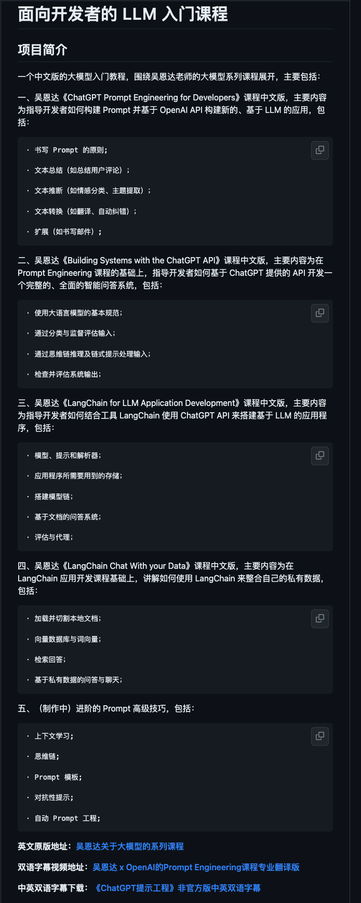

这是个人学习 AI 大模型过程中，收集的一些资料，做了分类整理，也有一些总结，希望对你有帮助。

# GPT 论文

# 向普通人解释 GPT 原理

[通俗解构语言大模型的工作原理](https://mp.weixin.qq.com/s/PPXaOrLnIV6JlXvgYB74Wg) 这里面文字白话介绍词向量、词预测、以及Transformer架构原理，整篇文章篇幅很短，适合粗略的阅读看看，里面说的 transformer 架构可以看这个小视频，更加形象的理解 https://m.okjike.com/originalPosts/64be4d567b5daee543aba806

# GPT 学习课程

^e3c1ba

[吴恩达大模型系列课程中文版，包括《Prompt Engineering》、《Building System》和《LangChain》 (github.com)](https://github.com/datawhalechina/prompt-engineering-for-developers)

这个课程内容质量非常高，推荐都去看看，已经翻译成中文了，方便阅读。

# 写好提示词

这个详细参考 [prompt-Writing](prompt-Writing.md)

# 对未来的影响

> 对于现阶段来说，LLM 是一个 Copilot。它不会不改变软件工程的专业分工，但增强每个专业技术，基于AI的研发工具平台辅助工程师完成任务，影响个体工作。
> thoutworks - Phodal

